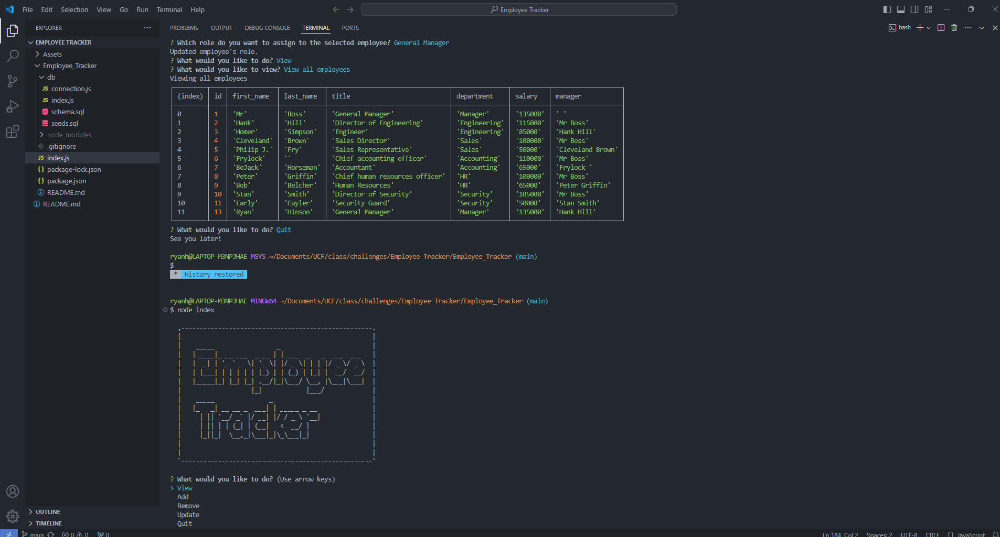
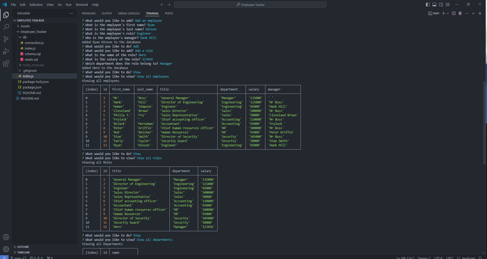
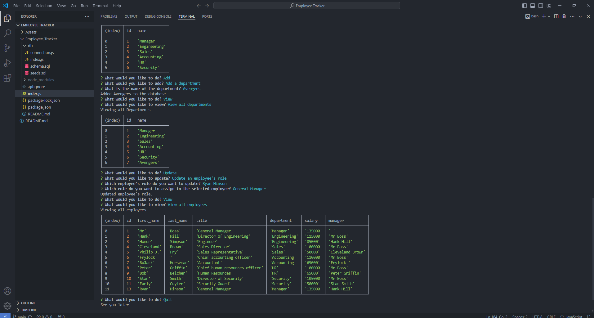

# Employee_Tracker
Tracking my employees and seeing what department they in and who is there manager.

## Description

I was motivared in this challenge to be able to make my own logo so I don't have to hire a graphic designer to make one. The goal I wanted to accomplish was after a series of questions a SVG Logo is generated and I can view it in the browser. I also wanted to be able to run tests for my shapes to know that they would generate. I learned how to create a SVG with some xml to view in browser and also learned how to write a test and let them run with jest.

I was motivated in this challenge to make a DB and a table were I can track employees that show who is there boss, salary, and the department they are in. The goal I wanted to complete was to view all employees, all departments, and all roles. I also wanted to add and delete employees, roles, and departments then I wanted to be able to update employee roles to change there info I also wanted to update manager roles. I learned how to make a connection with postgres linking up my DB and JS so I can view/update in my console the data. I also learned how to create a DB and make a table for it and then make a seeds file were I can add info into the DB. I also learned how to use a prompt to open up certain tables and update that table if needed. 

## Website Link

https://watch.screencastify.com/v/xYGh1M8Qy5VGLErPiFzf
          
## Installation
npm install
          
## Usage

node index.js
  

          
## Questions
If you have any questions or need further clarification, you can reach me at [ryanhinson118@gmail.com](mailto:ryanhinson118@gmail.com) or visit my GitHub profile at [https://github.com/RyanH118](https://github.com/RyanH118).